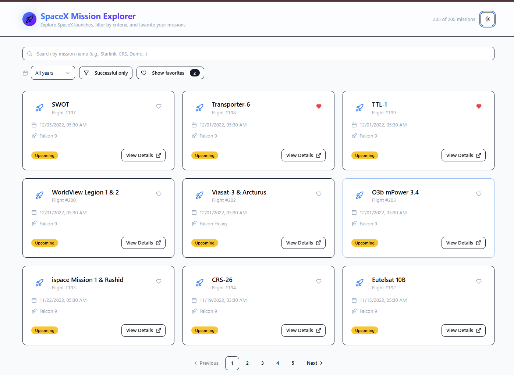
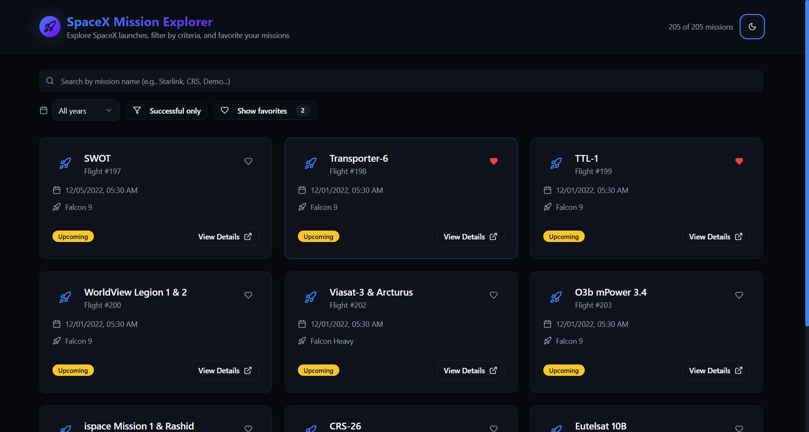
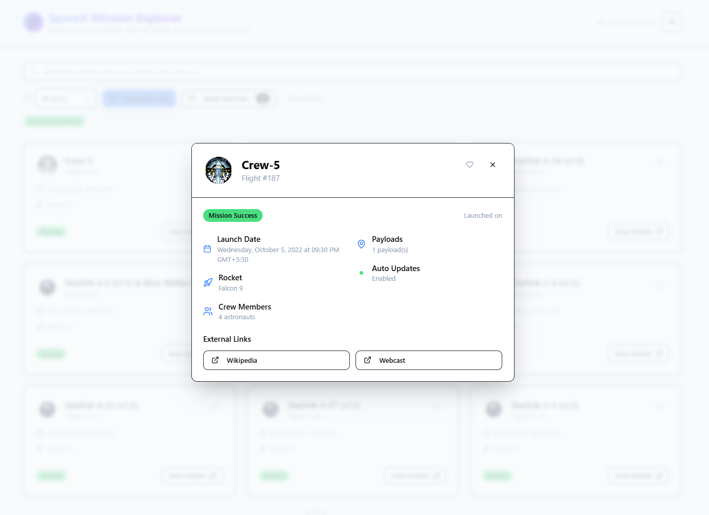
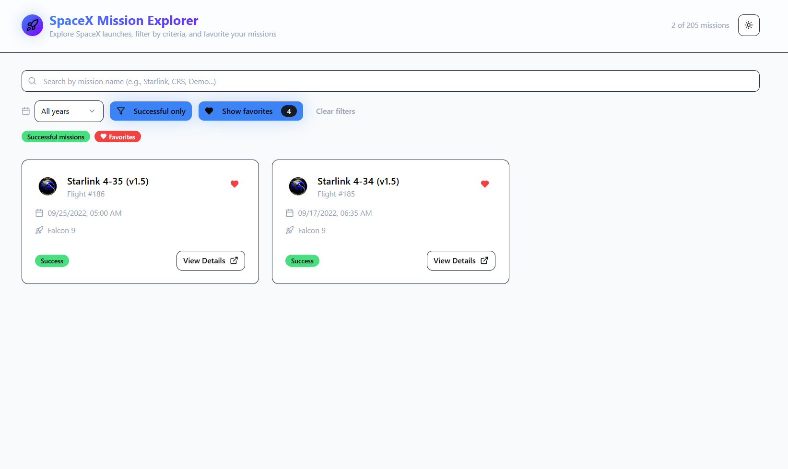
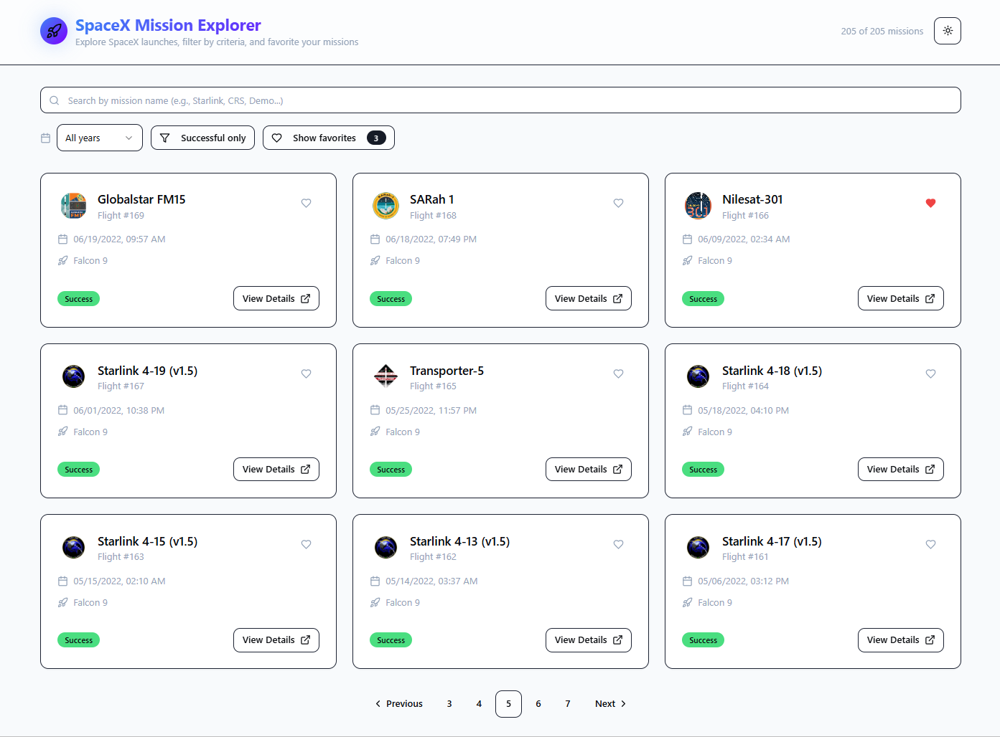
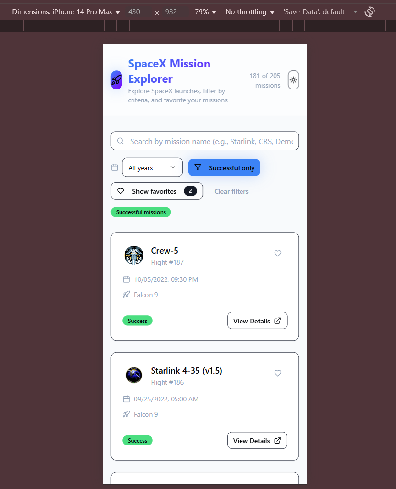

# 🚀 SpaceX Mission Explorer

<div align="center">
  

  [Live Demo](https://spacex-mission-explorer-five.vercel.app/) | [GitHub Repository](https://github.com/prashantrai0628/spacex-mission-explorer.git)
</div>

A modern, elegant React application for exploring SpaceX launches with real-time updates, favorites system, and a beautiful space-themed UI. Built with performance and user experience in mind.

## 📸 Screenshots

### Light & Dark Theme Support
<div align="center" style="display: flex; gap: 20px; margin-bottom: 20px;">
  
  
</div>

### Interactive Mission Details
<div align="center" style="margin-bottom: 20px;">
  
</div>

### Advanced Search & Filtering
<div align="center" style="margin-bottom: 20px;">
  
</div>

### Smart Pagination
<div align="center" style="margin-bottom: 20px;">
  
</div>

### Responsive Mobile Design
<div align="center" style="margin-bottom: 20px;">
  
</div>

## ✨ Key Features

- 🚀 Real-time SpaceX mission data with detailed information
- � Beautiful space-themed UI with dark/light mode
- ❤️ Instant favorites system with persistent storage
- 🔍 Advanced search and filtering capabilities
- � Year and success status filtering
- � Stunning dark mode experience
- 📱 Fully responsive design for all devices

## 🛠️ Tech Stack

<div align="center">
  
  
  
  
  
  
  
  
  
  

</div>

### Core Technologies
- **React 18** with Hooks for modern UI development
- **TypeScript** for type-safe code
- **Vite** for lightning-fast builds
- **TailwindCSS** for utility-first styling

### State Management & Data Fetching
- **React Query** for server state management
- **Zustand** for client-state management
- **Local Storage** for persistence

### UI Components & Design
- **shadcn/ui** for beautiful, accessible components
- **Lucide Icons** for modern iconography
- **Responsive Design** for all devices

## 🚀 Quick Start

### Prerequisites

- Node.js (v18 or higher)
- npm or yarn

### Local Development

1. Clone the repository:
```bash
git clone https://github.com/prashantrai0628/spacex-mission-explorer.git
cd spacex-mission-explorer
```

2. Install dependencies:
```bash
npm install
# or
yarn install
```

3. Start the development server:
```bash
npm run dev
# or
yarn dev
```

4. Open your browser and navigate to `http://localhost:5173`

### Testing

Run the test suite:
```bash
npm run test
# or
yarn test
```

### Production Build

Create a production build:
```bash
npm run build
# or
yarn build
```

## 📁 Project Structure

```bash
src/
├── components/           # Reusable UI components
│   ├── ui/              # shadcn/ui components
│   ├── MissionCard      # Mission display card
│   ├── MissionFilters   # Search & filter controls
│   ├── MissionModal     # Mission details modal
│   ├── EmptyState       # Empty state displays
│   ├── theme-provider   # Theme context provider
│   └── theme-toggle     # Theme switching button
│
├── hooks/               # Custom React hooks
│   ├── useSpaceX       # SpaceX API integration
│   ├── useFavorites    # Favorites management
│   └── use-mobile      # Mobile detection hook
│
├── pages/              # Application pages
│   ├── Index          # Main missions page
│   └── NotFound       # 404 error page
│
├── types/             # TypeScript definitions
│   └── spacex.ts     # SpaceX API types
│
└── lib/              # Utility functions
    └── utils.ts      # Helper functions
```

## ✨ Key Features

### 🚀 Real-time Mission Data
- **Live SpaceX Data**: Real-time mission information
- **Rich Details**: Launch dates, success rates, and rocket information
- **External Links**: Direct access to Wikipedia, YouTube, and other resources

### 🔍 Smart Filtering & Search
- **Instant Search**: Find missions by name or keywords
- **Year Filter**: Browse launches by year
- **Success Filter**: Focus on successful missions
- **Active Filters**: Visual indicators for applied filters

### ❤️ Favorites System
- **One-Click Favorites**: Easy mission bookmarking
- **Persistent Storage**: Favorites saved across sessions
- **Quick Access**: Filter to view favorite missions
- **Counter Badge**: Track favorite missions count

### 🎨 Modern UI/UX
- **Responsive Design**: Perfect on all devices
- **Dark/Light Themes**: Choose your preferred theme
- **Smooth Animations**: Polished user interactions
- **Accessibility**: ARIA-compliant components

### ⚡ Performance
- **Fast Loading**: Optimized data fetching
- **Smart Caching**: Efficient data management
- **Pagination**: Smooth browsing experience
- **Offline Support**: Basic functionality without internet

## API Integration

This project uses the [SpaceX REST API](https://docs.spacexdata.com/) to fetch:
- Launch data (`/launches`)
- Rocket information (`/rockets`)

Data is cached using React Query for optimal performance and user experience.

## Building for Production

```bash
npm run build
```

The built files will be in the `dist` directory, ready for deployment to any static hosting service.

## Acknowledgments

- SpaceX for providing the public API
- The React and Vite communities for excellent tooling
- shadcn for the beautiful UI component library